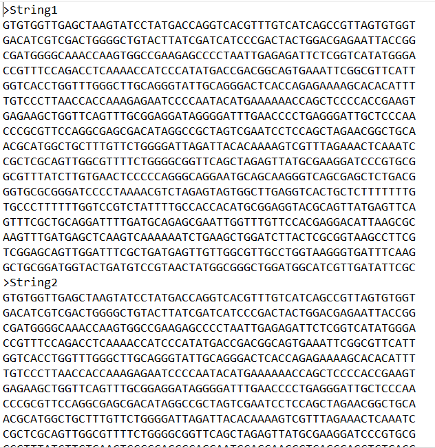

# SOBRE O DESAFIO

Depois de uma aula sobre métodos de string, o professor passou um desafio para que usássemos os códigos aprendidos em aula.
O desafio passicamente consistia em receber um arquivo com strings quebradas e transfrmar essas strings quebradas em uma única string.

